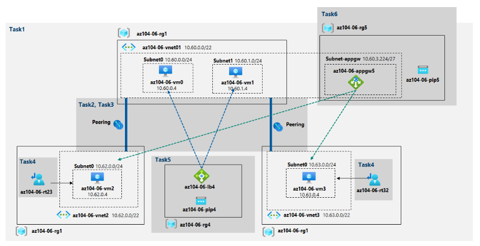

# AzureLab06
Implement Traffic Management Student lab manual

En este lab implementaremos un "hub spoke topology" para el tráfico de red. La topología
debe incluir Azure Load Balancer y Azure Application Gateway.

## DIAGRAMA DE LA ARQUITECTURA

## Instrucciones

### Ejercicio 1

#### Tarea 1: Aprovisionar el entorno de laboratorio

En esta tarea, implementará cuatro máquinas virtuales en la misma región de Azure. Los dos primeros residirán en una red virtual central, mientras que cada uno de los dos restantes residirá en una red virtual radial separada.

1. Inicie sesión en el [portal de Azure](https://portal.azure.com/) .

2. En Azure Portal, abra **Azure Cloud Shell**. En nuestro caso, lo haremos a través de las terminal de **PowerShell**. Procedemos a conectarnos.

3. Cargaremos nuestra carpeta 06 del lab, material ofrecido por el profesor:**\Allfiles\Labs\06\az104-06-vms-loop-template.json** y **\ Allfiles\Labs\06\az104-06-vms-loop-parameters.json**. Luego le asignaremos unos determinados valores para crear nuestros recursos:

   *$location = 'eastus'*

   *$rgName = 'az104-06-rg1'*

   *New-AzResourceGroup -Name $rgName -Location $location*

   

   

4. Desde PowerShell, ejecutaremos lo siguiente para crear las tres redes virtuales y las cuatro máquinas virtuales de Azure en ellas usando la plantilla y los archivos de parámetros que cargó:

   *New-AzResourceGroupDeployment `*

   -ResourceGroupName $rgName ` 

   *-TemplateFile $HOME/az104-06-vms-loop-template.json `*

   *-TemplateParameterFile $HOME/az104-06-vms-loop-parameters.json `*

5. Ejecutaremos lo siguiente para instalar la extensión Network Watcher en las máquinas virtuales de Azure implementadas en el paso anterior con la siguiente configuración:

   *$rgName = 'az104-06-rg1'*

   *$location = (Get-AzResourceGroup -ResourceGroupName $rgName).location $vmNames = (Get-AzVM -ResourceGroupName $rgName).Name*

   *foreach ($vmName in $vmNames) {*

   *Set-AzVMExtension `*

   *-ResourceGroupName $rgName `*

   *-Location $location ` -VMName $vmName*

   *-Name 'networkWatcherAgent' `*

   *-Publisher 'Microsoft.Azure.NetworkWatcher' `*

   *-Type 'NetworkWatcherAgentWindows' `*

   *-TypeHandlerVersion '1.4' }*

   

   Después comprobamos el grupo de recursos que qeudaría algo tal que así:

   

   #### Tarea 2: Configurar la topología de red de concentrador y radio

   1. Ahora vamos a configurar el peering entre las redes virtuales que anteriormente fueron desplegadas

      Tenemos que anotar el Resource ID de la vnet2 y vnet3 dentro de sus propiedades.

      Nos vamos ahora a la siguiente ruta dentro de **vnet1>Settings>Peerings>Add** y rellenaremos con la siguiente configuración:

      | Settings                                  | Value                                                        |
      | ----------------------------------------- | ------------------------------------------------------------ |
      | This virtual network: Peering link name   | **az104-06-vnet01_to_az104-06-vnet2**                        |
      | Traffic to remote virtual network         | **Block traffic that originates from outside this virtual network** |
      | Virtual network gateway                   | **None (default)**                                           |
      | Remote virtual network: Peering link name | **az104-06-vnet2_to_az104-06-vnet01**                        |
      | Virtual network deployment model          | ***\*Resource manager\****                                   |
      | I know my resource ID                     | enabled                                                      |
      | resource ID                               | resource ID anteriormente anotada                            |

      El resto de valores se quedan por defecto.

      Primero hacemos del peering 1 al 2 y viceversa y luego la del 1 al 3:

      

      Luego haremos el otro peering entre la 1 y la 3, y la 3 y la 1 a través de powerShell:

      

      

      ### Tarea 3: Probar la transitividad del emparejamiento de redes virtuales

      ------

      1. Comprobaremos la comunicación tras los emparejamientos mediante el Connection TroubleShoot Del Network Watcher:

      

      

      En este caso da como resultado *reacheable* y ahora comprobamos con la Vm2 a la 10.63.0.4:

      

      Da como resultado *unreacheable*.

      

      **Nota** : Esto es de esperar, ya que las redes virtuales de dos radios no se emparejan entre sí (el emparejamiento de redes virtuales no es transitivo).

      ### Tarea 4: Configurar el enrutamiento en la topología de concentrador y radio

      ------

      1. Configuramos el routing:**vm0>az104-06-nic0>settings >IP configurations**

      2. Activamos IP forwarding (Enabled)

         

      3. Volvemos a la vm0 y seleccionamos **Run command**: *Install-WindowsFeature RemoteAccess -IncludeManagementTools*Este comando instala el role de acceso remoto para windows server.

         

         

         

      4. Ejecutamos otro comando para el routing role service:

      *Install-WindowsFeature -Name Routing -IncludeManagementTools -IncludeAllSubFeature*

      *Install-WindowsFeature -Name "RSAT-RemoteAccess-Powershell"*

      *Install-RemoteAccess -VpnType RoutingOnly*

      *Get-NetAdapter | Set-NetIPInterface -Forwarding Enabled*

      

      

      5. Ahora creamos las tablas de enrutamiento:

      **Services>Route Tables**

      | Settings                 | Value             |
      | ------------------------ | ----------------- |
      | Subscription             | La enabled        |
      | Resource group           | **az104-06-rg1**  |
      | Location                 | eastus            |
      | Name                     | **az104-06-rt23** |
      | Propagate gateway routes | No                |

      

      6. Accedemos a la tabla de rutas creada y añadimos la siguiente configuración:

         | Settings                             | Value                             |
         | ------------------------------------ | --------------------------------- |
         | Route name                           | **az104-06-route-vnet2-to-vnet3** |
         | Address prefix destination           | **IP Addresses**                  |
         | Destination IP addresses/CIDR ranges | **10.63.0.0/20**                  |
         | Next hop type                        | **Virtual appliance**             |
         | Next hop address                     | **10.60.0.4**                     |

         

         7. Asociamos la subnet 0 de la vnet2 dentro del apartado subnets, queda justo debajo de rutas

            | Settings        | Value              |
            | --------------- | ------------------ |
            | Virtual network | **az104-06-vnet2** |
            | Subnet          | **subnet0**        |

            

            8. Creamos otra tabla de enrutamiento esta vez de la 3 a la 2

            | Settings                 | Value             |
            | ------------------------ | ----------------- |
            | Subscription             | La enabled        |
            | Resource group           | **az104-06-rg1**  |
            | Location                 | eastus            |
            | Name                     | **az104-06-rt32** |
            | Propagate gateway routes | No                |

            

            9. Añadimos las rutas

            | Settings                             | Value                             |
            | ------------------------------------ | --------------------------------- |
            | Route name                           | **az104-06-route-vnet3-to-vnet2** |
            | Address prefix destination           | **IP Addresses**                  |
            | Destination IP addresses/CIDR ranges | **10.62.0.0/20**                  |
            | Next hop type                        | **Virtual appliance**             |
            | Next hop address                     | **10.60.0.4**                     |

            

            

            

            10. Asociamos la subnet de la red 3

            | Settings        | Value              |
            | --------------- | ------------------ |
            | Virtual network | **az104-06-vnet3** |
            | Subnet          | **subnet0**        |

            

            

            Con estas comprobaciones no terminaron de funcionar, por lo que nuestro profesor nos recomendó dejar de esta manera los peering:

            

            ### Tarea 5:

            ------

            1. Creamos el balanceador de carga con la siguiente configuración:

            | Settings       | Value                                                        |
            | -------------- | ------------------------------------------------------------ |
            | Subscription   | La enabled                                                   |
            | Resource group | **az104-06-rg4**                                             |
            | Name           | **az104-06-lb4**                                             |
            | Region         | **name of the Azure region into which you deployed all other resources in this lab** |
            | SKU            | Standard                                                     |
            | Type           | **Public**                                                   |
            | Tier           | **Regional**                                                 |

            

            2. Pasamos ahora a la siguiente configuración del *Frontend*

            | Settings          | Value             |
            | ----------------- | ----------------- |
            | Name              | **az104-06-pip4** |
            | IP version        | IPv4              |
            | IP type           | IP address        |
            | Public IP address | **Create new**    |
            | Availability zone | **No Zone**       |

            3. Luego seguiremos con la configuración del *Backend*

            | Settings                   | Value                     |
            | -------------------------- | ------------------------- |
            | Name                       | **** az104-06-lb4-be1**** |
            | Virtual network            | **az104-06-vnet01**       |
            | Backend Pool Configuration | **NIC**                   |
            | IP Version                 | ***\*IPv4\****            |

            Add virtual machine; Añadimos ambas

            4. Inbound rules> add load balancing route

            | Settings                                           | Value                    |
            | -------------------------------------------------- | ------------------------ |
            | Name                                               | **az104-06-lb4-lbrule1** |
            | IP Version                                         | **IPv4**                 |
            | Frontend IP Address                                | **az104-06-pip4**        |
            | Backend pool                                       | **az104-06-lb4-be1**     |
            | Protocol                                           | **TCP**                  |
            | Port                                               | 80                       |
            | Backend port                                       | 80                       |
            | Health probe                                       | **Create new**           |
            | Name                                               | **az104-06-lb4-hp1**     |
            | Protocol                                           | **TCP**                  |
            | Port                                               | **80**                   |
            | Interval                                           | **5**                    |
            | Unhealthy threshold                                | **2**                    |
            | Close the create health probe window               | **OK**                   |
            | Session persistence                                | **None**                 |
            | Idle timeout (minutes)                             | **4**                    |
            | TCP reset                                          | **Disabled**             |
            | Floating IP                                        | **Disabled**             |
            | Outbound source network address translation (SNAT) | **Recommended**          |

            

            5. Revisamos y reamos

            Vamos al recurso, guardamos la IP del frontend y comprobamos que el balanceo de carga funciona:

            

            

            Podemos comprobar que el balaceador funciona correctamente entre las máquinas virtuales.

            ### Tarea 6:

            ------

            1. Añadimos una subnet a la vnet1 con los siguientes datos

            | Settings             | Value              |
            | -------------------- | ------------------ |
            | Name                 | **subnet-appgw**   |
            | Subnet address range | **10.60.3.224/27** |

            2. A continuacion buscamos en el portal Application Gateway > +create

            

            

            

